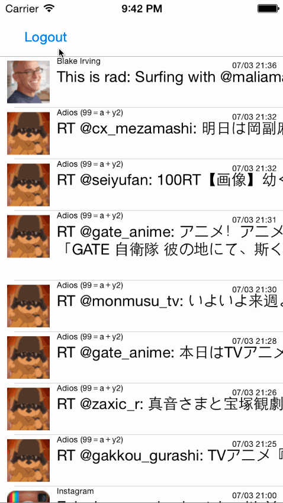

# iOSTwitterClient with Hamburger

## Twitter Redux 

This is a basic twitter app to read and compose tweets the [Twitter API](https://apps.twitter.com/).

Time spent: 8

### Features

#### Hamburger menu

- [ ]Dragging anywhere in the view should reveal the menu.
- [ ]The menu should include links to your profile, the home timeline, and the mentions view.
- [ ]The menu can look similar to the LinkedIn menu below or feel free to take liberty with the UI.

#### Profile page

- [ ]Contains the user header view
- [ ]Contains a section with the users basic stats: # tweets, # following, # followers
- [ ]Optional: Implement the paging view for the user description.
- [ ]Optional: As the paging view moves, increase the opacity of the background screen. See the actual Twitter app for this effect
- [ ]Optional: Pulling down the profile page should blur and resize the header image.

#### Home Timeline

- [ ]Tapping on a user image should bring up that user's profile page

#### Optional: Account switching

- [ ]Long press on tab bar to bring up Account view with animation
- [ ]Tap account to switch to
- [ ]Include a plus button to Add an Account
- [ ]Swipe to delete an account

- [X] User can sign in using OAuth login flow
- [X] User can view last 20 tweets from their home timeline
- [X] The current signed in user will be persisted across restarts
- [X] In the home timeline, user can view tweet with the user profile picture, username, tweet text, and timestamp.  In other words, design the custom cell with the proper Auto Layout settings.  You will also need to augment the model classes.
- [X] User can pull to refresh
- [ ] User can compose a new tweet by tapping on a compose button.
- [ ] User can tap on a tweet to view it, with controls to retweet, favorite, and reply.
- [ ] User can retweet, favorite, and reply to the tweet directly from the timeline feed.

### Walkthrough

